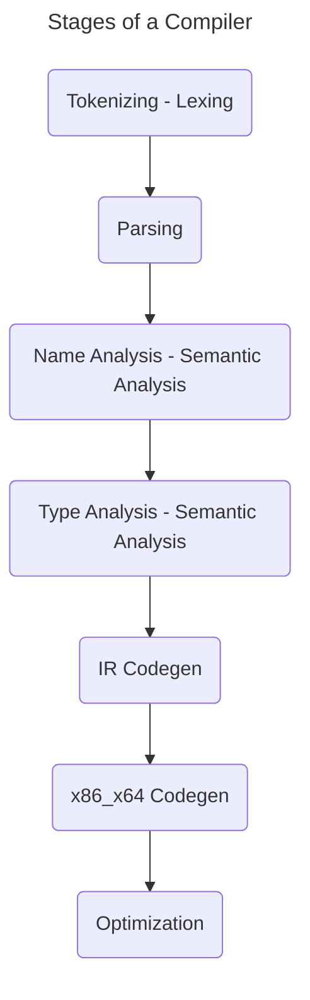

I recently finished up my second to last semester of my CS degree where I mostly took some major/minor required courses and a particularly bad Software Engineering II course (different topic for another day -_-). However, I did take a very exciting course which I had been looking forward too for a long time, **Compiler Construction**, which absolutely did not disappoint.

The professor for this class in particular was one of the best I've had up to this point. He was both very knowledgeable and excited to teach the course which made the entire class so much better, but what really stood out to me was how many fields of computer science the class actually touched. From front to back building a compiler requires knowledge of foundational computer science topics like [DFAs](https://en.wikipedia.org/wiki/Deterministic_finite_automaton) and [CFGs](https://en.wikipedia.org/wiki/Context-free_grammar), to data structures such as [ASTs](https://en.wikipedia.org/wiki/Abstract_syntax_tree), hash maps, and so much more. The class assignments were also taught in C++ and heavily made use of OOP which I thought was a good choice in particular as it increased my understanding and fluency in/of both.

## Parts of the Compiler

Each part of the compiler comes with its own unique set of requirements and use of topics in computing. My professor decided to break a compiler up into about 7 different sections across 8 projects which were as follows. Unfortunately, we didn't have time to get to the final project (optimization) but did cover it in class.

### Frontend

**Tokenizing** and **Parsing** were fairly straight forward to implement. With the advent of tools like [lex/flex](https://en.wikipedia.org/wiki/Flex_(lexical_analyser_generator)) and [yacc/bison](https://en.wikipedia.org/wiki/GNU_Bison) the actual projects were very straight forward. We spent a lot of time here on the actual theory behind building and implementing the tools themselves. Specifically how regexes are converted into *DFAs* and how tables are generated from those DFAs. Parsing focused a lot more on different types of parsers (LL, LL(1), LR, SLR in particular). We discussed what types of grammars they could parse and how to generate graphs and tables based off a set of [formal grammar](https://en.wikipedia.org/wiki/Formal_grammar) rules. Most of these topics were touch on if not covered in my Computing Theory class.

### 'Middle-end'

**Type** and **Name** analysis are both forms of semantic analysis which check to see if variables and types of expressions and variables are used correctly according to the language's spec. Semantic analysis is a very active and huge field of study right now in many computer science programs. Cutting edge research usually focuses on formal methods. Type analysis and type theory in particular are very interesting right now and [Rust](https://rust-lang.org), one of the coolest new programming languages on the block, use a very interesting type analysis system to ensure that the program executes as intended at runtime.

### Backend

**IR Codegen** or Intermediate Representation codegen, is a way to represent the tree-like structure of a program in a more linear fashion. Both IR Codegen and **x86_x64 Codegen** are actually fairly straight forward, but the more interesting part of this stage of the compiler is finding optimizations! This usually includes both scanning through the IR to look for dead code, or constants which can be inserted elsewhere in the program, or even finding peephole optimizations like removing 'net-zero' instructions the compiler emits. [Zig](https://ziglang.org/), another pretty cool up-and-coming language performs what it calls 'comptime' here, which essentially runs part of your code at compile-time to reduce both binary sizes, and compute power!

## Why You Should Learn to Build a Compiler

Compilers are large and complex, but learning about them helped me understand so much about the field of computer science and building software. Just to name a few of the topics I touched:

- Computing Theory and Implementation of Theory (CFGs/DFAs)
- Type Theory/Formal Methods/Programming Language Analysis
- Operating Systems (Linker/System Libraries/Standard Libraries/Memory)
- Computer Architecture (Memory Layout/Stack/Heap/etc.)
- Assembly (Program Layout)
- OOP (Implementation)
- Data Structures and Algorithms (Hash Maps/Linked List/Trees with Visitors)

In my eyes understanding how compilers work can help anyone in computer science discover and learn about so many interesting fields of computer science. Not only that, but it can expand your practical skills by forcing you to understand what's actually happening under the hood of almost any language you write in. This class used to be required at my university but was removed for some reason completely unknown to me. I sincerely hope that it gets reinstated as a required class because its usefulness and ability to incorporate so many subfields of CS is incredibly valuable to me.

